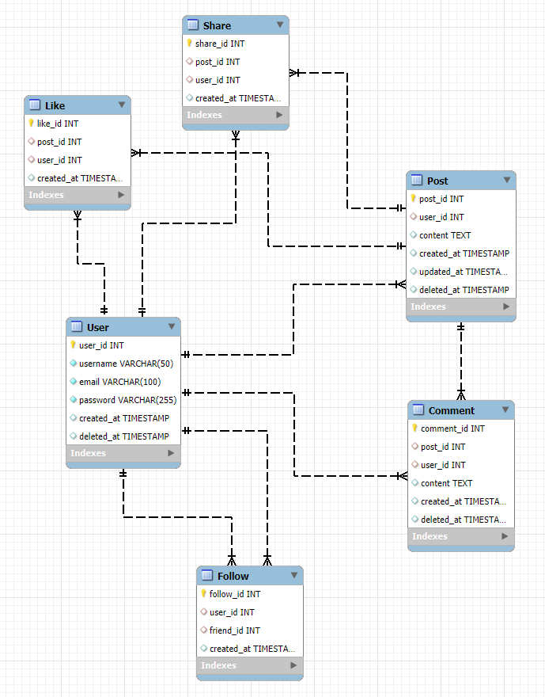

# An ERD diagram describes the DB design, field types, relationships, constraints, etc. ( a screenshot on your repo is fine)

# SQL which implements above ERD. (MySQL)

[Check out the SQL script](./croconews-schema-creation.sql)

# A Python microservice implemented using Flask microframework that should connect to MySQL DB and have the following endpoints

* an endpoint to add new post at `/post`
* an endpoint to update post at `/post/{post_id}` with the `PUT` method
* an endpoint to delete post at `/post/{post_id}` with the `DELETE` method
* an endpoint to get post at `/post/{post_id}` with the `GET` method

# Important Notes
There are endpoints for registration and login. You can use the following endpoints to register and login

* an endpoint to register user at `/register` with the `POST` method
* an endpoint to login user at `/login` with the `POST` method

### The post endpoints are protected by JWT token.